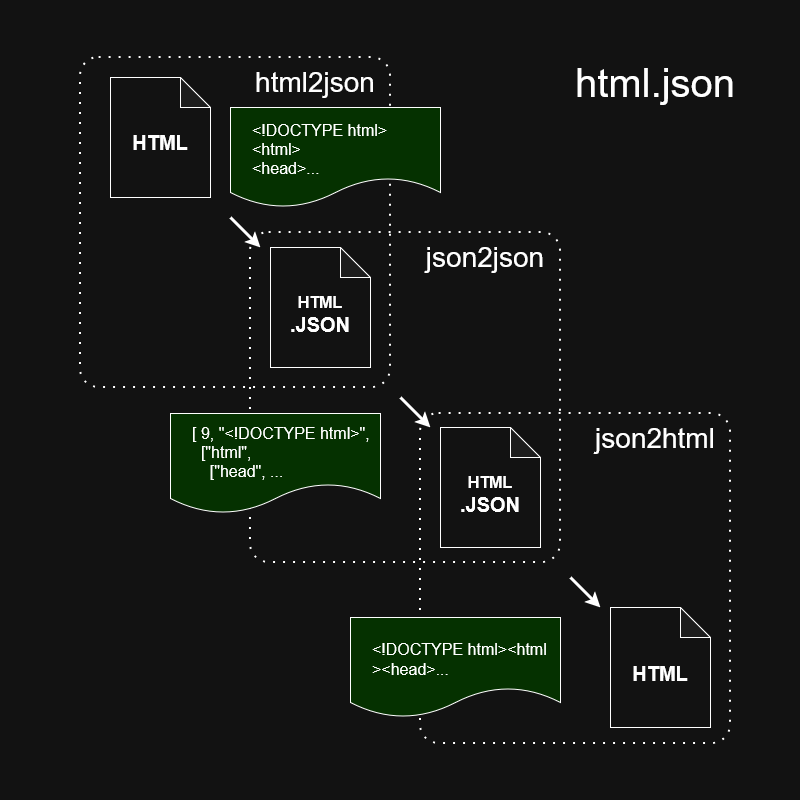

# HTML.JSON

A compact and portable format that can be converted back to HTML in a lightweight way.

And Tiny Streaming SSR!

[Edit in draw.io](https://viewer.diagrams.net/?tags=%7B%7D&lightbox=1&highlight=0000ff&edit=_blank&layers=1&nav=1&title=html.json.drawio.png&dark=auto#R%3Cmxfile%20scale%3D%221%22%20border%3D%220%22%3E%3Cdiagram%20name%3D%22%E3%83%9A%E3%83%BC%E3%82%B81%22%20id%3D%22VvOWJ_1VzUAwgAVYdgJi%22%3E7Zpbc5s4FMc%2Fyz74sR5duNiPCUna3U3XmXFnOrtvBBRMIyOvkGNnP%2F0KkDASdk2ocTNNXhJzJB1JPx39dYERDpbbjzxcLT6zmNARAvF2hK9GCE2QI%2F8WhufK4PuwMiQ8jStTwzBP%2FyPKCJR1ncYkNzIKxqhIV6YxYllGImHYQs7Zxsz2wKhZ6ypMSMswj0Latn5NY7FQ3QJgZ%2F9E0mQhrIRlqPMqQ74IY7ZpmPD1CAecMVH9Wm4DQgt0GktV7uZAat0uTjLRpcA6%2Bv3P25un4J%2FZnDowYVd3VxcfoN92ozzn4lkz4GydxaTwA0f4crNIBZmvwqhI3chBl7aFWFKVHPJIjaInnx5SSgNGGZfPGcuk%2BTIXnD3WMCWHyzjMF7X74uEuFILwrLQg4Ehr1aankK5Vm5SBcEG2jXarvn8kbEkEf5ZZFo3RwVgNxmY3lFhHmnLj6AFTAetArKJJRVJS%2B97Rlj8U8JfAd9%2FhW%2FAnJnvXHwp9F%2FJyxq5IiU6Q4%2Bjvw%2BgxKQdrthY0LWgrpPxxJkulougUGAP3ZEQhahOFwCQKoYnUHwop6oJU9k5YEUvTpIi1SJYiMlAvCwap1N8LlbBM45ge4r%2BbHKCId5YJFf6oflaVwxbyT18%2B3%2FbC7rep%2BxZ05BrQIRiKutImErdWse8NA8nii2JtLLjTMM%2FTyBwUE6upGfhQ%2BH4fmqsIcUJDkT6ZrW2Q1Pn2kVI13LFUdq2GjbAZ4QhasHO25hFRpZorpO3Isxw5liMR8oSIlqNy4Opu9x9L582IUj1fDpE%2B2fzotMS%2BJlUaIY8KlctopffvmumED3np70JmgN5qW46dTpe%2FkuJ%2FJW%2BVM4mu8lclafM915bxH%2FPZXwOJIZqYYjjcEjR5F0MHmDMLT3uKoWOpqoPOK4bTNyOGjnOE9Ol2vaAL1Hc1HFINHddUQ2e4Mw58l0PXtw%2BUPeXQs3TVs3f0A8sh7HS8%2BiX00INHUJ9uhnTacb8mPRzwzOpZZ1YPT4bC7nXB%2FqbuvWpp03tkjIaCP3ldMT%2FZx7moF33LWdYLuLtHY1yLt2OvC0Ph7rSP%2Fcm4C9KD4nbgucIbvbIt7mHeZeUD8Xate%2FTh3mF021PqfUnMovWyzHd0b1IRvb3XhqamjxAOgpub6fR0%2BxLQhopsjbZOxMNd6upO9A1iSh7EyUIYevspe%2BGyKFcenX67mgVf%2Fr67LqiWYa0SD5yvzMI9SpAwNkuMx%2BNe4%2B7h9lyyr6%2BspRna18unG3b8ZuYS9M8mUD%2B4xz%2FPXCrDOk6f6nh3ZTYg9w6y08C4zXjBrKsLBXsnlL4LaVa7pyXaa3afr8pnUDZOe1c1t%2Bvq4fnYs1VzpQLNmkGpA%2Fvr73No8tuBbL9enZ4tkDu9yvgl1AFbkusNJ7mdjqI%2FWx1eMOfb6%2BqhlfTc62r9IZQeZGsJ8Aa79kadPnI625nAAYeOvOPeZ7DJHt7WpHKtSeWAsfti4PJx98Vadbe5%2B%2BoPX%2F8P%3C%2Fdiagram%3E%3C%2Fmxfile%3E)

1. HTML を json で表現する(変換する html2json)
2. json から HTML への変換時に処理を追加できる(json2html, ProcessingInstruction, Instruction Attribute)
3. 文書の ProcessingInstruction ノードと Instruction Attribute の中に、決定済の値があれば、静的ノードと静的属性値に置き換える(json2json)
4. HTML を予め json 化しておけば、実行環境に HTML パーサーが不要になる
   * Web サーバ側での動的生成のソース(AMP HTML, メディアタイプ別専用ページ)
   * オフラインドキュメントのコンテンツデータ
   * PJAX のコンテンツデータ
   * 非力な DHTML ブラウザで、文書をページャーで表示する(要素のサイズを測りながら描画する)際のコンテンツデータ
5. Templete 等を利用した Web サイトを開発したい場合、[gulp-nice-page-builder](https://github.com/itozyun/gulp-nice-page-builder/tree/htmljson) を使用します

## 目次

1. コンパイルとテスト
   1. Streaming SSR のデモ
2. html.json の例
3. API の概要
4. HTML の minify
5. 条件付きコメントに関する情報
6. License

## 1. コンパイルとテスト

~~~sh
git clone https://github.com/itozyun/html.json.git
cd html.json
npm i
git submodule update --init

npm run make
npm run test

# Do when the node module is updated
gulp externs
~~~

## 1.1. Streaming SSR のデモ

次を実行した後にブラウザで http://localhost:8080/ を開く．

~~~sh
npm run demo

# Do when the "sample/src/*" files are updated
gulp sample
~~~

このデモのソースコードは [sample/src](sample/src/) にあります。

## 2. html.json の例

html.json は HTML と等価な JSON のサブセットです．定義は『[html.json 定義](doc/HTMLJSON.md)』にあります．

閉じタグの省略できない HTML 要素が多い文書などでは、HTML 形式よりファイルサイズが小さくなります．

~~~html
<!DOCTYPE html>

Hello, world!
~~~

↓

~~~json
[
  9, "<!DOCTYPE html>",
  [ "P", "Hello, world!" ]
]
~~~

## 3. API の概要

次の4系統の API を利用できます．詳しい文書は『[API](doc/API.md)』を確認します．

json2json で使える Virtual DOM の説明は『[Restricted VNode](doc/RESTRICTED_VNODE.md)』を確認します．

json2json, json2html で利用できる Restricted Virtual DOM の説明は『[Restricted VNode](doc/RESTRICTED_VNODE.md)』を確認します．

1. html2json
   * HTML を html.json 形式に変換します．
   * html2json.gulp が利用できます．
2. json2json
   * html.json の編集が行えます．
   * 動的ノードと動的属性の内で、決定済の値があれば、静的ノードと静的属性に置き換える．
   * json2json.gulp が利用できます．
3. json2html
   * html.json を html 形式に変換します．
   * 変換時に処理を追加します．
   * ストリーミング SSR の json2html.stream が利用できます
   * json2html.gulp が利用できます．
4. filter.gulp
   * 静的ページまたは、動的ページだけ処理したい場合に便利な gulp プラグインです

## 4. HTML の minify

html2json, json2json ではテキストノードの最適化と[空白ノードの除去](https://outcloud.blogspot.com/2025/11/optimize-whitespaces.html)を行います．

json2html では、閉じタグとクォートを省略して HTML を最小化します．

より詳しい情報は『[html.json と HTML の最小化](doc/MINIFY_HTML.md)』を確認します．

## 5. 条件付きコメントに関する情報

html.json は条件付きコメントをサポートします．条件付きコメントに独自に割り振られた nodeType は『[html.json 定義](doc/HTMLJSON.md)』で確認出来ます．

条件付きコメントに関する情報は『[条件付きコメント](doc/CONDITIONAL_COMMENTS.md)』にあります．

## 6. License

[HTML.JSON](https://github.com/itozyun/html.json) is licensed under MIT license.

(C) 2024-2026 [itozyun](https://github.com/itozyun)([blog](//outcloud.blogspot.com/))
