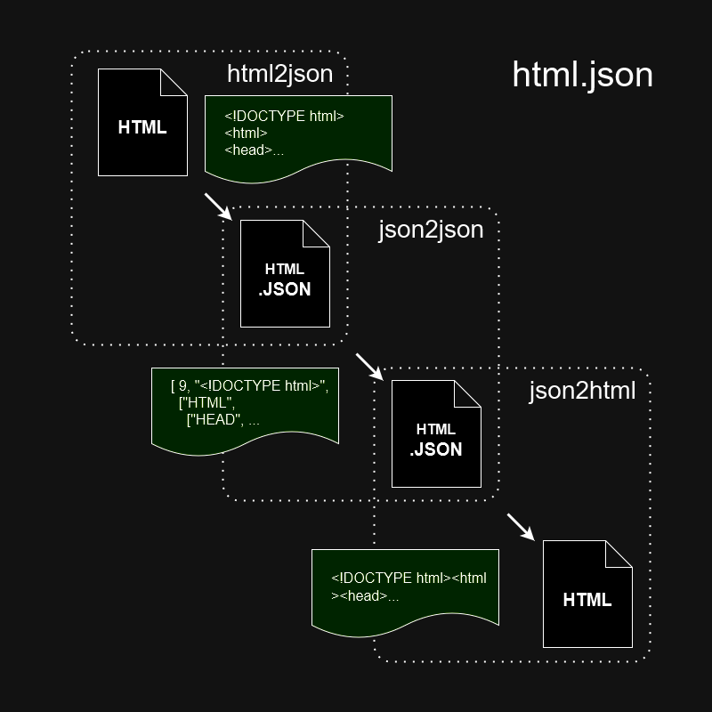

# HTML.JSON

A compact and portable format that can be converted back to HTML in a lightweight way, achieving Web 1.0 level SSR!

[jsonml](http://www.jsonml.org/)([wiki](https://en.wikipedia.org/wiki/JsonML)) の拡張です.

[Edit in draw.io](https://viewer.diagrams.net/?tags=%7B%7D&highlight=0000ff&edit=_blank&layers=1&nav=1&title=%E5%90%8D%E7%A7%B0%E6%9C%AA%E8%A8%AD%E5%AE%9A%E3%83%95%E3%82%A1%E3%82%A4%E3%83%AB.drawio#R7ZpRl6I2FMc%2FSx98XA8hgPqoONNtO1vnHPecnvaNgQzSicSGODr99A2QoAmxqAdxdfdl19yQG%2FLLzf8mGXrQX25%2FpsFq8YVECPdsK9r24LRn20PL4f%2Fmho%2FSMPCEIaZJVJrAzjBP%2FkXCaAnrOolQpjzICMEsWanGkKQpCpliCyglG%2FWxV4LVXldBjGqGeRjguvWPJGILOSxrZ%2F%2BMknjBtIplIJ8VhmwRRGSzZ4IPPehTQlj5a7n1Ec7RSSxlu8cDtdV7UZSyYxqsw19%2Be3p89%2F%2BazbEDYjJ9no4%2FgUHp5j3AazFg8bbsQxKgZJ1GKPcCenCyWSQMzVdBmNdu%2BJRz24ItsagOaCjm0OOl1wRjn2BCeTklKTdPMkbJW4WSU5hEQbao3OeF54AxRNPCYvP4gRPxkogytD04fFBB5bGIyBIx%2BsEfEQ0cOQ8iDh0Ay%2FJmN6tQBt1ib0YhFMZARFJc%2Bd7R5j8E8FPgu98L%2FKHK3h1cHX0zeb5eV6hAx1Az%2BpcgfIuLyZqtGU5y2gIpfZvxVgnLx271LbcdogCoSAd1pMAyIAX2pZDaNaSfv355qmHlQ2Za1OIkzuMt5ENHPFgnOZiEK%2FBYVCyTKMKH5mC3QKw85knKxBKwq7LoHLSB3XYV7MCqcx8YsA8uRR02BzJKo3GeCHPEOMiyJFT5qwRViYBVtKKolicboe1BcQ1QpI0iHLDkXXVvIiV6eCYJ77iaExuqS8GWSU26yMiahki02s%2BQuiNPc%2BRojlhAY8RqjoqJq4Z9%2Flw6ty5KVZjrAK%2BnSqYU62EmpEGB6%2F2zJrLiU1aIyJg%2FALzVtsAj6%2FmvOP%2B%2FlLfSGX%2B30l9ZJc0vVFr6v85nv9%2BZGNpDVQxNSahTMRz%2BEEPHUpcgHJ0pho6mqo7drRiObl0MHecAwOuJodwz%2FlDDC6ih46pq6BhOOZ2qITjikHPvcugO9JPnmXLoabrqWd3KIagfr25MDz1wgOAV9bC%2B477DM6unnVk9OLyyMHnNsXwf916VjMkdMrRr6Lu%2B%2BapvknOS9t8ZSa8Y%2BMOWgDu63tc15v%2FSTfu46%2FvYnPSd4HZAc3x3y9uub3EL3gXTm%2Bftahfppj9idMz7hJv0iITrZTHSxr1JCfLpRRr2Nb1nQ99%2FfByNWpIM7aBrutK1TRpdbVbah2ra7HnBMqdUnKR%2Bms78r38%2BP%2BRvVAS2qDxw3FIbn9ECBZHaot%2Fvn7CaMHplra0l4F0mNwNgyBWmfZEHLzXtR1zmf9trCQya9anrtWS6VS%2FDPUreq3h3%2BfAtnqt5J5ZyuXHCqqsa%2BcYFJa9G9rs1vIn0mr5kq6JsFS8nvYt7lnpfZ3huKms9P4ynWs9WoQPm%2Fm9bHcDoiEg2nVb1C4b2AvmIrwW%2BbXWAmuJ6BsXtWh1MR9FT1nw9rx7KpN9LXoVaDvAM997VR1Hd5NX6R045zP51z2CO1dKZQFtVjtV3j1tWw9OB8%2BLui7XybnP31R98%2BA8%3D)

1. html を json で表現する(変換する)
2. json から html への変換時に処理を追加できる
   * HTML を予め json 化しておけば、実行環境に HTML パーサーが不要になる
     * Web サーバ側での動的生成のソース(AMP HTML, モバイル専用ページのソース)
     * オフラインドキュメントのコンテンツデータ
     * PJAX のコンテンツデータ
     * 非力な DHTML ブラウザで、文書をページャーで表示する(要素のサイズを測りながら描画する)際のデータ

## コンパイルとテスト

~~~sh
npm run make
npm run test

# Do when the node module is updated
gulp externs
~~~

## 目次

1. html2json
   1. 動的コンテンツ
   2. 動的属性
2. json2json
3. json2html
4. HTML.JSON 定義
5. HTML の最小化

## 1. html2json

[ES2 HTML Parser](https://github.com/ECMAScript2/htmlparser) で HTML をパースします．

* `trimWhitespaces` と `removeNewlineBetweenFullWidthChars`
* `keepCDATASections`
* `keepComments`
* `keepEmptyConditionalComment`
* `argumentBrackets`
* `instructionAttrPrefix`

### `trimWhitespaces` と `removeNewlineBetweenFullWidthChars`

1. `removeNewlineBetweenFullWidthChars` オプションが `true` の場合、全角文字の間の改行文字を削除する
2. タブ文字を半角スペースに置換
3. 連続する改行を1つの改行へ
4. テキストノードの最後の連続する改行を削除
5. `trimWhitespaces:"aggressive"` を指定すると、テキストノードの前後の空白文字をすべて削除する
   * 但し次のいずれかを満たす場合、前後に一つの半角スペースを残す
     1. テキストノードの先頭が改行ではない
     2. 後ろが改行と改行に続く0個以上の空白文字ではない
6. 改行を半角スペースに置換
7. 連続する半角スペースを1つ半角スペースへ
8. 半角スペースを保護したい場合 `\u0020`, `&#32;`, `&#x20;` を使う

#### `trimWhitespaces:"aggressive"` でテキストノードの前後の空白文字をすべて削除する

~~~html
    

    html.json
    

~~~

~~~json
[ [ "DIV" ], "html.json", [ "DIV" ] ]
~~~

#### `trimWhitespaces:"aggressive"` でもテキストノードの前後の空白文字を1つづつ残す

~~~html
<b>1</b> / <b>10</b>
~~~

~~~json
[ [ "B", 1 ], " / ", [ "B", 10 ] ]
~~~

### 1.1. ProcessingInstruction

~~~html

<? createSidebar("",6,{}) ?>

~~~

~~~js
[
    "DIV#side",
    [
        7, // ProcessingInstruction
        "createSidebar", // メソッド名
        "", 6, {} // メソッドの引数
    ]
]
~~~

### 1.2. ProcessingAttr

~~~html
<ul :class="toggleList('productList',1)"></ul>
~~~

~~~js
[
    "UL",
    {
        ":class" : [ // 動的属性
            "toggleList", // メソッド名
            "productList", 1 // メソッドの引数
        ]
    }
]
~~~

## 2. json2json

動的コンテンツの内、決定した値を `onInstruction` で埋め込むことが出来る．

~~~js
json2json( json, onInstruction, opt_onEnterNode, opt_onError, opt_options );

function onInstruction( methodName, args, currentHtmlJson ){
    return undefined; // null or '' or string or number or html.json
};
~~~
### json2json の `onInstruction` の戻り値

json2html と微妙に異なる点に注意!

#### `InstructionNode`

* `undefiend` : 何もしない
* `null` or `""` : `InstructionNode`を削除
* `{string|number}` TEXT_NODE になる
* strict な html.json `[json2json.DOCUMENT_FRAGMENT_NODE, ["P", "Hello, world!"]`, `[ 1, "P", ...node ]`, `[ "P", "Hi!" ]` や `[ 3, "Hello, world!" ]`
* 戻り値が `[json2json.PROCESSING_INSTRUCTION, "funcName", ...args ]` も可能．このノードは再度 `onInstruction` で処理される．

#### `InstructionAttr`

* `undefiend` : 何もしない
* `null` : 属性を削除する
* `htmlparser.BOOLEAN_ATTRIBUTES` なプロパティであり属性値が `false` の場合、属性を削除する
* 戻り値が配列の場合、新しい関数名と引数の `InstructionAttr` に置き換わる 
* これ以外は属性値になる

### `opt_onEnterNode`

* Element に到達したときにコールバックされる
* 引数は DOM ライクに要素を操作できるオブジェクト
* 但し、文書ツリーの操作が出来るのは次に限る
  * 現在のノードの nodeValue の変更
  * 現在の Element の属性の操作
  * 現在の Element の直前への挿入
  * 現在の Element の子リストの最初への挿入
  * 現在の Element の子リストの最期への挿入
  * 現在の Element の直後への挿入
  * 現在の Element の削除
  * 現在の Element の子を空にする
  * ~~現在の Element を Element で wrap する~~

## 3. json2html

既に JSON パーサーがある環境では、json2html を用意するだけで、json データから html を生成できる．

~~~js
json2html( json, onInstruction, opt_strictQuot, opt_useConmma );

function onInstruction( methodName, args, currentHtmlJson ){
    return htmlString; // or [] html.json
};
~~~

### json2html の `onInstruction` の戻り値

json2json と微妙に異なる点に注意!

#### `InstructionNode`

* `undefiend` or `null` or `""` 何も書きださない
* `{string|number}` -> 文字列をそのまま埋め込む, htmlString もそのまま埋め込む
* strict な html.json `[json2html.DOCUMENT_FRAGMENT_NODE, [ "P", "Hello, world!" ]]`, `[2, "P", ...`, `[ "P", "Hi!" ]` や `[ 3, "Hello, world!" ]`
* 戻り値が `[json2html.PROCESSING_INSTRUCTION, "funcName", ...args ]` も可能．このノードは再度 `onInstruction` で処理される．

#### `InstructionAttr`

* `undefiend` or `null` : 属性を削除する
* `htmlparser.BOOLEAN_ATTRIBUTES` なプロパティであり属性値が `false` の場合、属性を削除する
* 戻り値が配列の場合、このノードは再度 `onInstruction` で処理される(無限ループにならずいつかは属性値を返すこと)
* これ以外は属性値になる

## License

[HTML.JSON](https://github.com/itozyun/html.json) is licensed under MIT license.

(C) 2024 [itozyun](https://github.com/itozyun)([blog](//outcloud.blogspot.com/))
