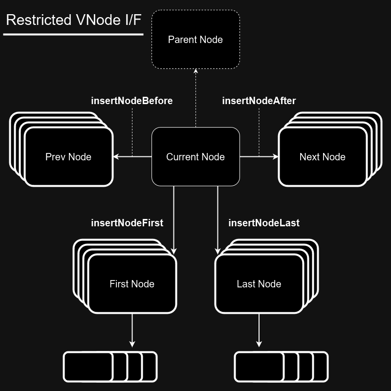

# Restricted VNode

json2html.stream では、制限された DOM I/F が利用できる．

VNode は `onEnterNode` の引数として渡される．この VNode はストリーミング中に作られたもので制限がある．

Element ノード、Document ノード、下の階層が隠れる条件付きコメント、Netscape4 用条件付きコメントは、開始タグを読み込んだタイミングで `onEnterNode` が呼ばれる．

Text, Comment, CDATA Section, 下の階層が見える条件付きコメントの開始タグと閉じタグはノードを読み込んだタイミングで `onEnterNode` が呼ばれる．

## 制限のレベルを整理する

次のはストリーミングが Current Node に達した時を示している．

~~~html
<ParentNode class="" name="">
    .
    .
    .
    <CurrentNode class="" title="">
    ^^^^^^^^^^^^^^^^^^^^^^^^^^^^^^^^
        ...???
    ...???
~~~

(1) Current Node の前方の兄弟ノードと Parent Node の開始タグは、既に次の処理(http リクエストなら response)に pipe している為、一切のノードの変更が出来ない．(下の図で点線のノード)

(2) Current Node の子ノードの情報も利用できないため、限られた情報を元に Current Node の操作や、その前後と子に新規 Node を挿入する．(下の図で細い枠線のノード)

(ただし Current Node が空の場合と、`empty()`、`setTextContent`、を実施した後は、新規 Node と同レベルの子に対する操作が可能)

(3) Current Node を起点にして新規に挿入された Node は、自身の子に対しては完全な操作ができる．(下の図で太い枠線のノード)

[Edit in drow.io](https://viewer.diagrams.net/?tags=%7B%7D&lightbox=1&highlight=0000ff&edit=_blank&layers=1&nav=1&title=%E5%90%8D%E7%A7%B0%E6%9C%AA%E8%A8%AD%E5%AE%9A%E3%83%95%E3%82%A1%E3%82%A4%E3%83%AB.drawio#R%3Cmxfile%3E%3Cdiagram%20name%3D%22%E3%83%9A%E3%83%BC%E3%82%B81%22%20id%3D%22_k6ujMt9y4ZIIED2RnfB%22%3E7Vxbj9o4FP41PLaKLwnwOJ122kptRTur3e1jRAxEDTEyZoD99esQ52aHTohysVFfRvFJ7MTf%2BY7PxWYm6HF7%2Bsj83eYrDUg0gU5wmqD3EwhdNBd%2FE8E5FUw9nArWLAxSESgEz%2BF%2FRAodKT2EAdlXHuSURjzcVYVLGsdkySsynzF6rD62olH1rTt%2FTTTB89KPdOk%2FYcA3qXTmOIX8EwnXG67c2PrZs1Kw3%2FgBPZZE6MMEPTJKeXq1PT2SKIEugyXt93Tlbv5djMS8SYfv3pttsIsWLxQtHoh3%2FvjXj19vkFTGix8d5ITl1%2FJzhgCjhzggyShggt4dNyEnzzt%2Fmdw9CpUL2YZvI3l7zxn9lSOFhUS%2BgDBOTlc%2FHeSACB4RuiWcncUjGYmmEsOMQxmmx0IjIAN%2BU9KGJ2W%2BJME6H7oASlxIrG7BDVmBGzYON2gFbsA03IBrA26wChtENbDNamADsDfcrFjfkIIbHh83K9Y3ZXmD7vi4OTbg5jnGGercBtzcuXGGOrMCt5l5htorbqAjv6DEIXl8MR5uevz2eGCX%2BUDnm8j9NBTF7HkVKj8K17G4XopehAlBglEoMq4HeWMbBkHSvRbzQiuOaK1ozGXOCJ2OQFe98bwGdFwDen9Bc8dcDfz9Jn%2B2D5qOzlI96lv4d03SugV1UI42yE9IHDwkBZkE1cjf78NlFfIqaOQU8n%2BT67eubP0s3Xl%2FKjfOWSMWUyl1Spo%2F5eiXRtHt0sr66Yt3jYmQQCsUKdoSs6UHtiSvux3uszXhr5m8rv2Set0a7WYyRiKfhy%2FVz61TuXzDgoYX28jI5VXJlZMtGyKdpuwFSyUnZSCsLgwzZaAUB22gCwPzabcnpderk%2B%2BpuGWAk59quH1LFkgjFs9hAvvRfT7oN0DtCjfjqAv0AHXByMsdc1ddPsanboNlt2UsUI4E8rjglVggd%2F6lXo1jATiO%2BwdXVD6Q%2F0cd%2BX%2Bk5v0D%2B3%2BgO7KOmAjaMNGxkIneHyJ2QUQrynRYcSW4zpUM7M6tqAtjJWFyndGBywY2HDglgMw3XkcEzorAGytbX%2B74NbcMpxJwX%2Fz9PWeNmtmPXoWDVmzbAtc4PwOtOCcADPQzVhxMAVPz%2FIwVxUkwM8%2FP6EndU8ju2tFAxzhH0yChabvfA8sbPlmiXZ9a958im5L6YjVjbZz6um69BQ%2BU%2BsIGGZzRTBmLARhXFYfaMkAdaGgGIDsyKsXTjX%2FmF1kRWqmHfg3AzY7Iam4cbg2q5Qbg5hmHmxXFXYCMw63HyMCQEBIatX2S1%2FdvjSDUPeYpGDaCyFIbW5kyFgFcOH9bjf083JIC%2BlCDk0API38QoZNwyYVaofN3mv07n8XoTxo9rlcBIrLindUAUEfnO5WDczXlqvycxyBrNYY3WWBMY%2FI787vm4cw1Ja%2FK%2FbYL6Rz9dpy%2BTUjfHgjjveBpYjrpZk1js%2BmseCZfBmqKaR0YkrpRhmt%2BsgPrwh71qEF3pqRvNRRKeEdWlI1Sw%2BxXDWoBHtRs%2BQysBj27LtQgC8p3pwXPOGPQc%2FVCCw%2BrBNS70wJGxtnCbefkpHev%2FEbieqTd8jcZTQOCBmfY0hV3rMhBTZ6QWn5te4gNq3zoO3q4bc%2FHKJaYk4G1Vr8%2BFOyskC%2BaxT%2BiSR8v%2FpkP%2BvA%2F%3C%2Fdiagram%3E%3C%2Fmxfile%3E)

### Parent Node(点線の枠線)

* `getNodeType`, `getTagName`, `getClassName`, `hasClassName`, `getAttribute`, `hasAttribute`, `getPrevNode`, `getParent`, `getMyIndex`
* insert*After, insert*Last, insert*First(但し currentNode jsonNodeIndex(srcIndex)=0 の場合)
* `getNextNode`(insertAfter している場合)

### Current Node(細い枠線)

* `getNodeType`, `getTagName`, `getClassName`, `hasClassName`, `getAttribute`, `hasAttribute`, `getPrevNode`, `getParent`, `getMyIndex`, `getTextContent`
* `setTagName`, `addClassName`, `removeClassName`, `setAttribute`, `removeAttribute`,  
* `insert*Before`, `insert*First`, `insert*Last`, `insert*After`
* `remove`, `empty`, `setTextContent`, `replaceNode`, `wrapNode`

#### Current Node(empty), Inserted New Nodes(太い枠線)

* `insert*At`, `getChildNodeCount`, `getTextContent`
